# Assignment-1

## 1. File and Directory Commands

Create a directory called `MyLinuxFiles` in your home folder. Inside it, create three files named `file1.txt`, `file2.txt`, and `file3.txt`. Display the list of files with detailed information.

### Output:
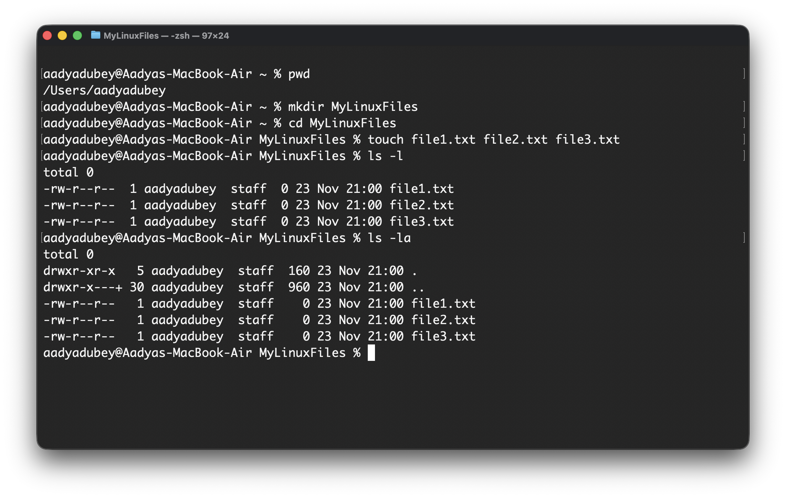

## 2. File Permissions

Change the permissions of `file1.txt` so that the owner can read and write, the group can read only, and others have no access. Verify the permissions.

### Commands Used:

- `chmod` – used to change the permissions of a file or directory
- `ls -l` – used to show detailed information of files

### Output:
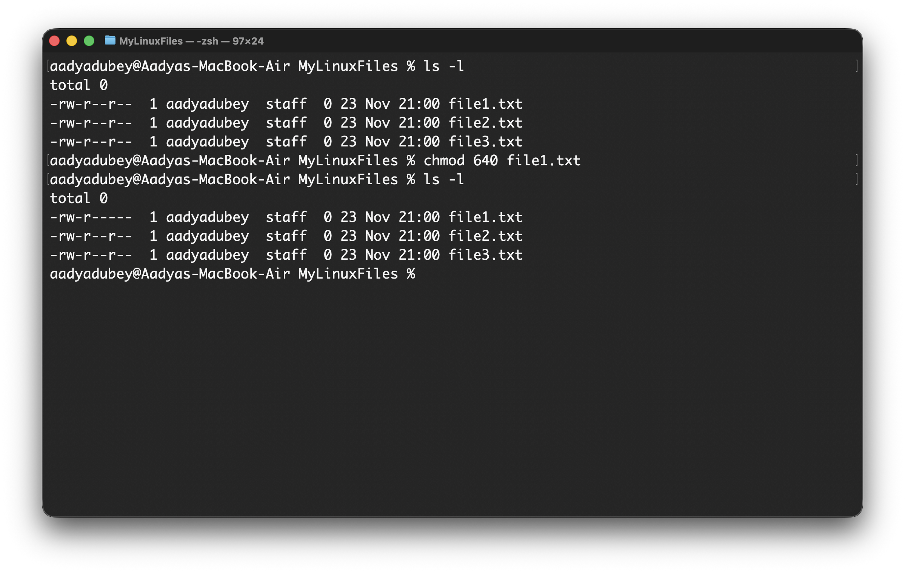

## 3. Text Processing

Use the grep command to find all lines containing the word "Linux" in a file named `notes.txt`. Count how many lines contain this word.

### Command Used:

- `grep [pattern] filename` – used to search a given pattern in a file

### Output:
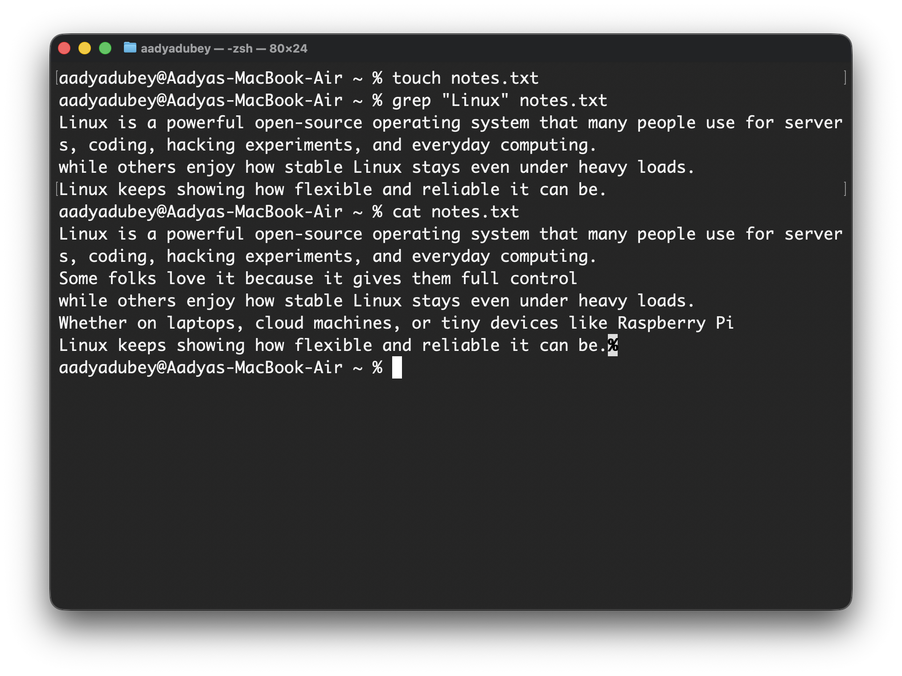
## 4. Redirection and Pipes

Write a command to display the contents of `file1.txt`, and save the sorted output into a file named `sorted.txt`.

### Commands Used:

- `cat filename` – used to view file content
- `sort filename` – used to arrange lines of text in a file in alphabetical or numerical order

### Output:
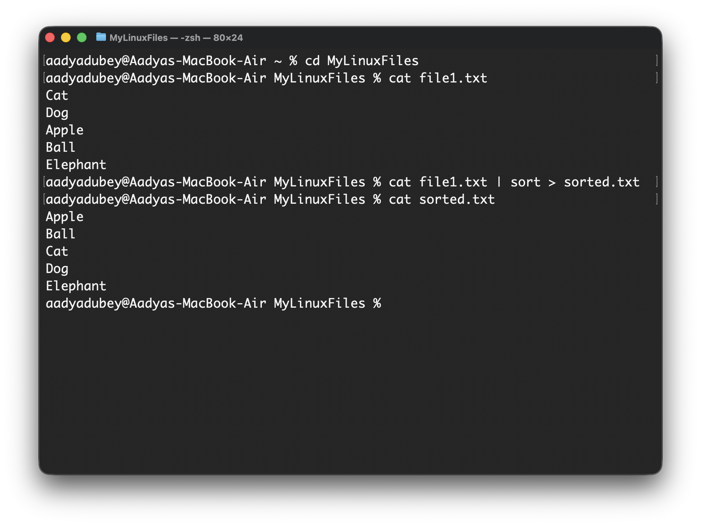
## 5. Shell Scripting (Arithmetic)

Write a shell script that takes two numbers as input from the user and prints their sum, difference, product, and quotient. Handle division by zero appropriately.

### Script:

```bash
#!/bin/bash

echo "Enter first number:"
read a

echo "Enter second number: "
read b

sum=$((a + b))
diff=$((a - b))
prod=$((a * b))

echo "Sum: $sum"
echo "Difference: $diff"
echo "Product: $prod"

if [ "$b" -eq 0 ]; then
    echo "Quotient: Division by zero not allowed"
else
    quot=$((a / b))
    echo "Quotient: $quot"
fi

```

### Output:
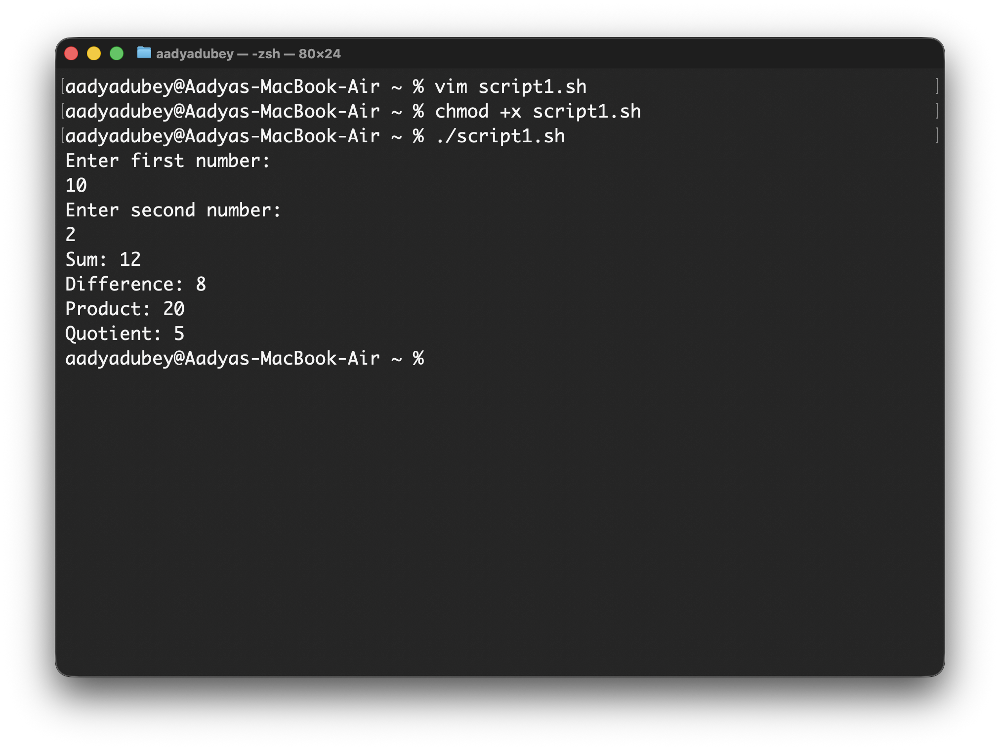
## 6. File Searching

Use the find command to search for all `.txt` files in your home directory that were modified in the last 7 days.

### Commands Used:

- `find [path] [options] [expression]` – used to search for files in the home directory
- `-mtime -n` – used with find to search for files modified in the last 7 days, here n is equal to number of days

### Output:
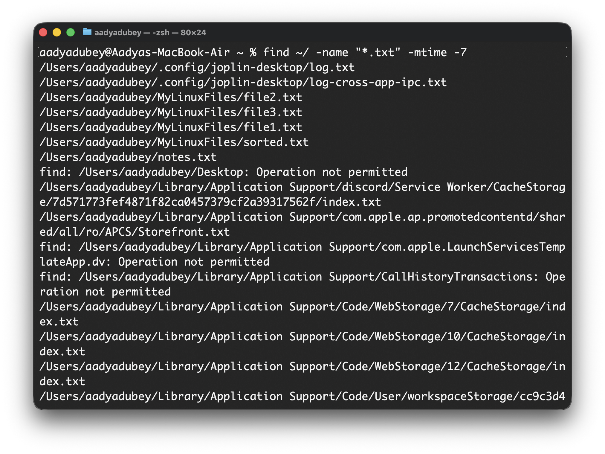
## 7. Archiving and Compression

Create a compressed archive of the directory `MyLinuxFiles` using `tar` and `gzip`. Then extract it to verify its contents.

### Commands Used:

- `tar -czf {archive_name} [files or dir]` – used to create a new compressed tar archive using gzip

### Output:
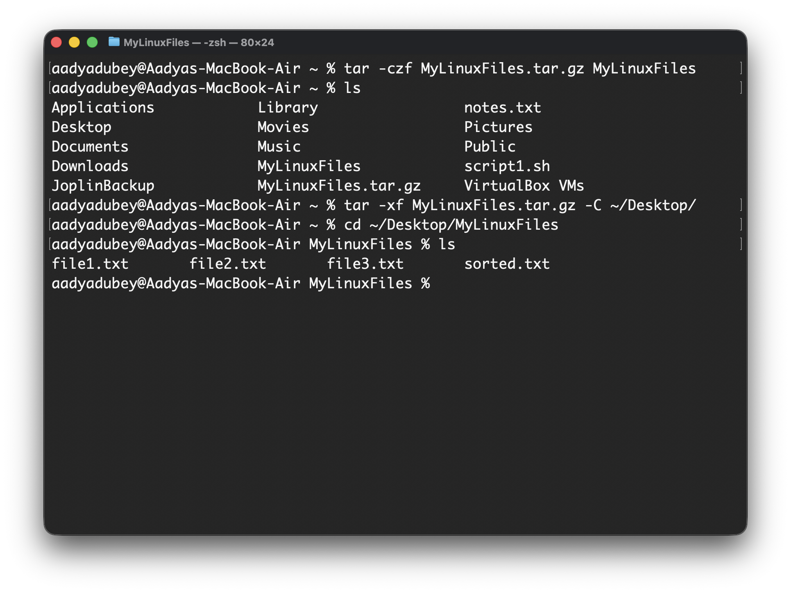
## 8. Networking

Display the IP address of your system. Use ping to check connectivity to google.com.

### Commands Used:

- `ifconfig` – used to displays your system’s IP address, net mask, broadcast, and network interface status.
- `ping` – tests network connectivity by sending packets to a host & checking if replies come back

### Output:
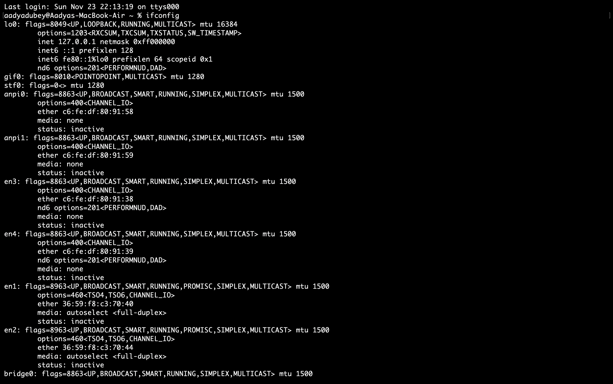
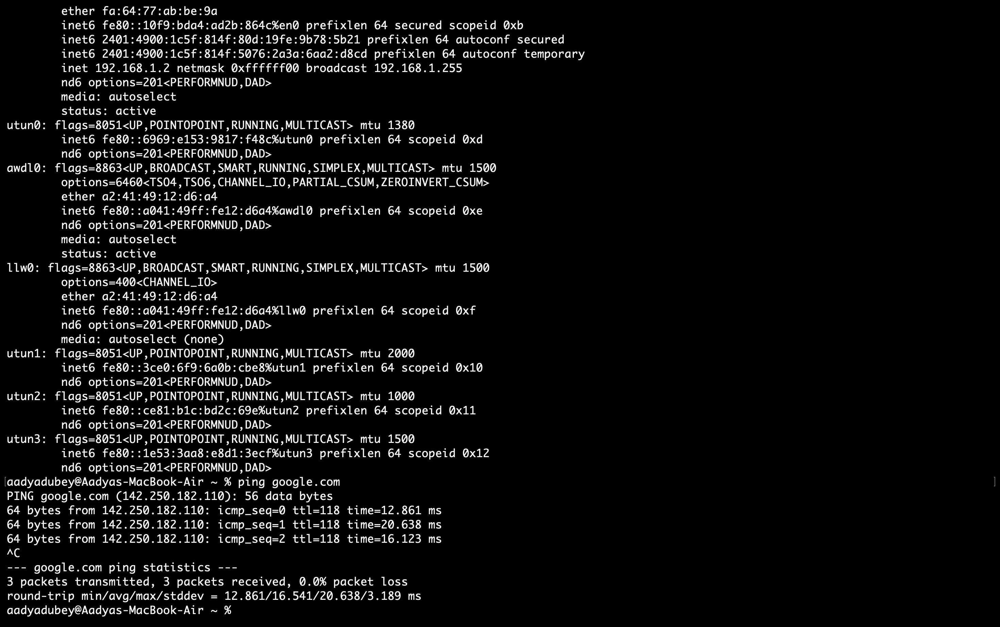
## 9. Largest of Three Numbers

Write a program to find the largest number among three numbers entered by the user.

### Script:

```bash
#!/bin/bash

echo "Enter three numbers:"
read a b c

if [ $a -ge $b ] && [ $a -ge $c ]; then
    echo "Largest: $a"
elif [ $b -ge $a ] && [ $b -ge $c ]; then
    echo "Largest: $b"
else
    echo "Largest: $c"
fi
```

### Output:
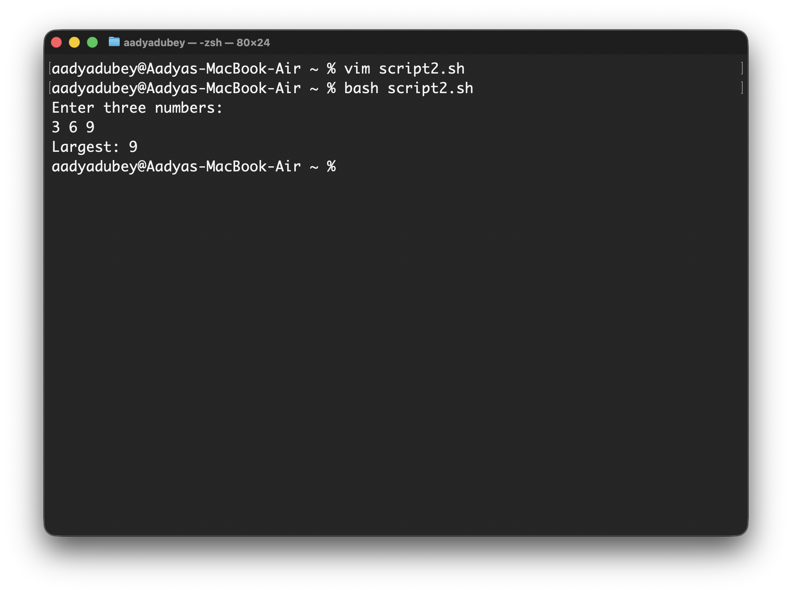
## 10. Sum of Natural Numbers

Write a program to find the sum of the first N natural numbers.

### Script:

```bash
#!/bin/bash

echo "Enter N:"
read n

sum=0

for ((i=1; i<=n; i++))
do
    sum=$((sum + i))
done

echo "Sum of first $n natural numbers: $sum"


```

### Output:
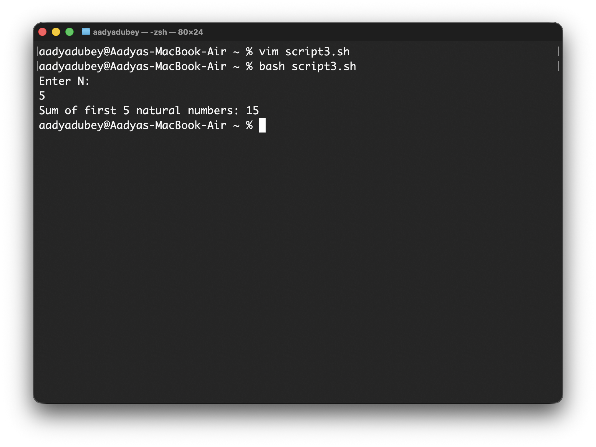
